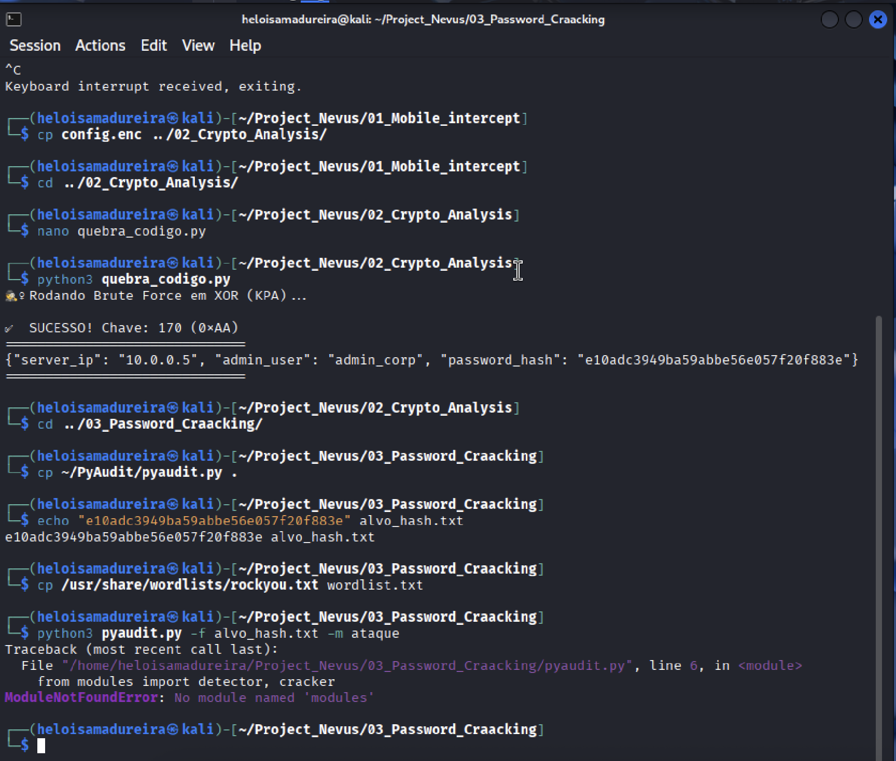
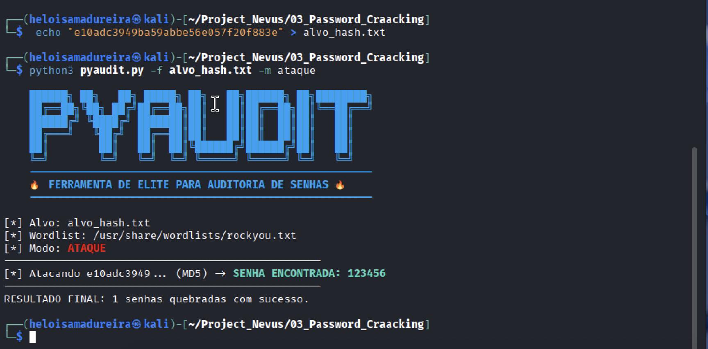
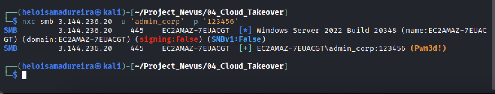
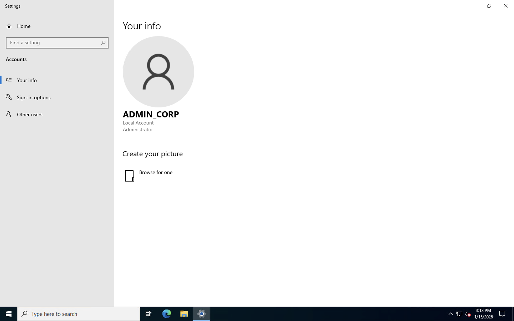

# 🚩 Project Nexus: Operação de Red Team (AWS & Active Directory)

## 📜 Resumo Executivo
Este projeto simula uma **Kill Chain** completa de um ataque cibernético ético. O objetivo foi demonstrar habilidades práticas em interceptação, criptografia, quebra de senhas e exploração de nuvem.

**O Desafio:** Partir de um arquivo criptografado interceptado em um dispositivo móvel e escalar privilégios até obter controle total (**Domain Admin**) de um servidor corporativo na AWS.

---

## 🕵️‍♀️ Fase 1: Interceptação e Criptoanálise (Python)
**Cenário:** Um arquivo confidencial `config.enc` foi interceptado contendo dados binários ilegíveis.
**Ação:** Desenvolvi um script em Python (`quebra_codigo.py`) para realizar um ataque de força bruta contra a criptografia XOR.
**Resultado:** A chave `0xAA` foi encontrada, revelando um JSON com credenciais criptografadas.

---

## 🔓 Fase 2: Password Cracking (PyAudit)
**Cenário:** O JSON revelou um hash MD5 da senha do administrador.
**Ação:** Utilizei minha ferramenta personalizada, o **PyAudit**, integrada com a wordlist `rockyou.txt` para realizar um ataque de dicionário.
**Resultado:** A senha foi quebrada em segundos: `123456`.

---

## ☁️ Fase 3: Cloud Takeover (AWS & SMB)
**Cenário:** Com as credenciais `admin_corp` validas, o alvo era um servidor Windows Server 2022 na AWS.
**Ação:** Utilizei o **NetExec (nxc)** no Kali Linux para testar o acesso remoto e a elevação de privilégio via protocolo SMB (Porta 445).
**Resultado:** `(Pwn3d!)` - Controle administrativo total confirmado via terminal.

---

## 🏆 Fase 4: Prova de Conceito (Acesso Visual)
**Ação:** Para demonstrar o impacto crítico da vulnerabilidade, realizei o login visual via **RDP (Remote Desktop)**.
**Resultado:** Acesso bem-sucedido à Área de Trabalho do Administrador, confirmando o comprometimento total do servidor.

---

## 🛠️ Tecnologias e Ferramentas
* **Linguagem:** Python 3 (Scripts de automação e criptografia)
* **OS:** Kali Linux (Atacante) & Windows Server 2022 (Vítima)
* **Cloud:** Amazon Web Services (AWS EC2, Security Groups)
* **Tools:** NetExec (CrackMapExec), RDP, Nano, Git.

---

## ⚠️ Aviso Legal (Disclaimer)
*Este projeto foi realizado em um ambiente de laboratório controlado e isolado (Sandbox), criado especificamente para fins educacionais e de pesquisa em segurança da informação.*
